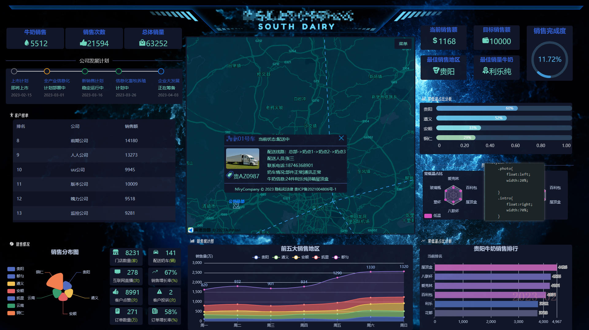
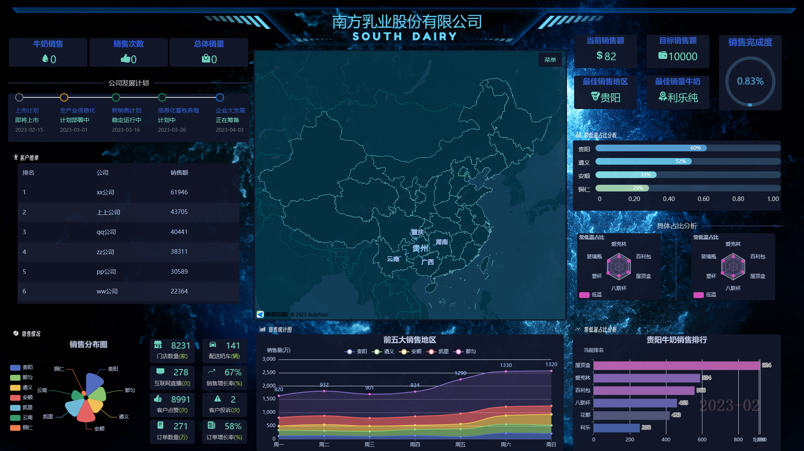
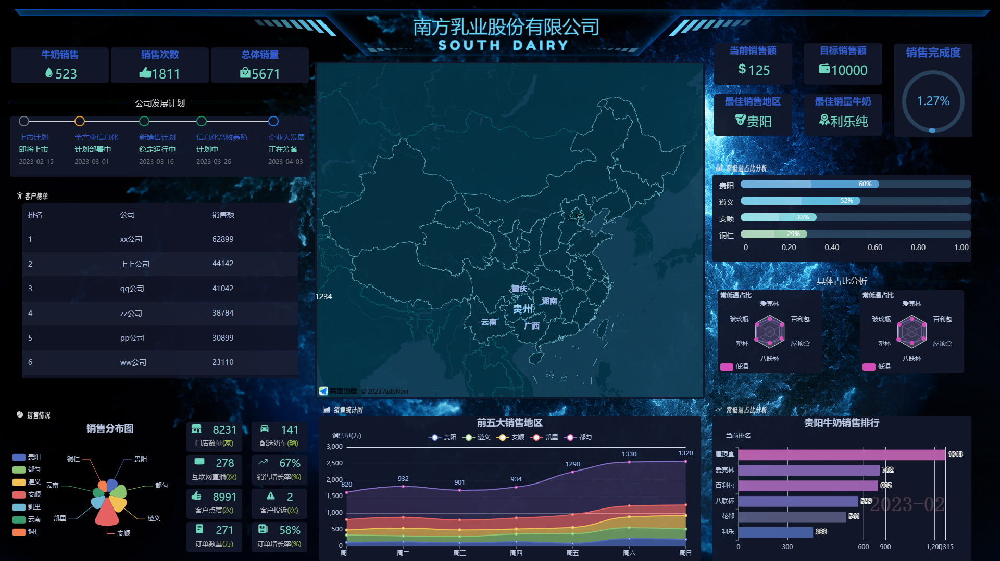
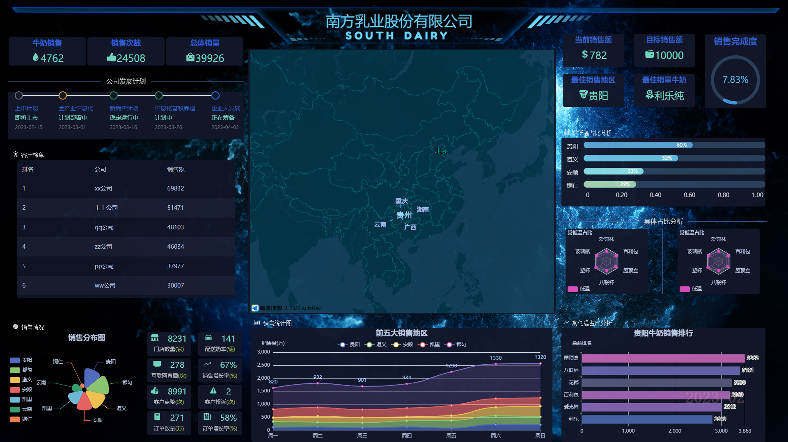
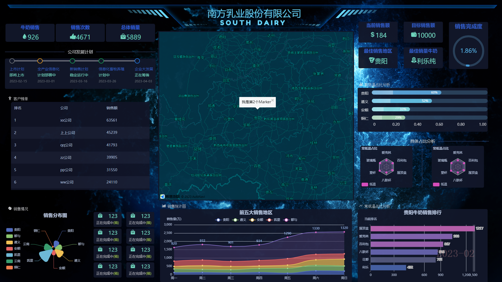
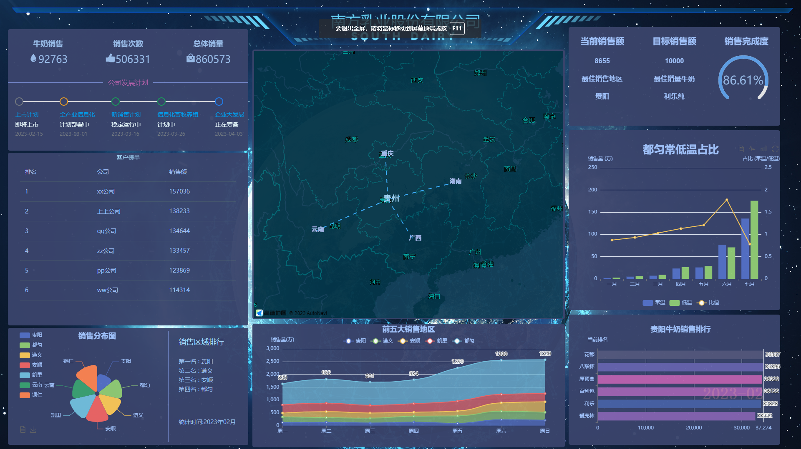
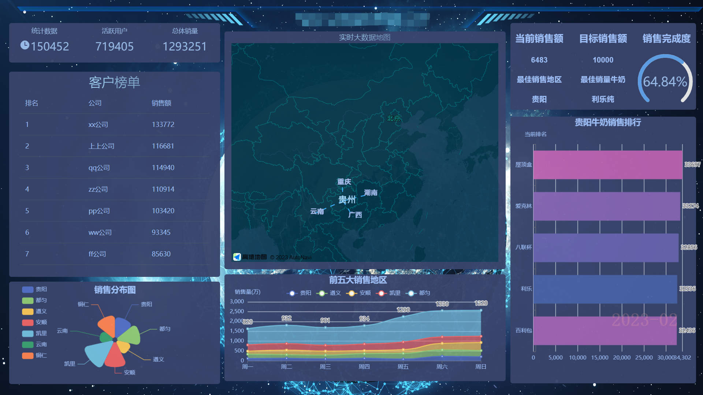

## 大数据展示界面

----
### 前端框架搭建
```
    ----vue3
    ----vite4
    ----vue-router4
    ----pinia   (暂未接入)
    ----naiveUI
    ----高德地图API
    ----自定义hooks
    
    2023.03.02
        1.奶车点的自定义样式窗体实现
        2.自定义hooks优化
    
    2023.02.28
        1.菜单选项添加
        2.自定义hooks优化
    
    2023.02.27
    地图整体优化，下一步添加具体交互
    
    2023.02.24
    八个小模块的模拟实现
    
    2023.02.23
    界面优化已经基本完成
    接下来的工作围绕地图进行具体展开
    
    2023.02.22
    当前已经开发到了第二个阶段
    该阶段的总体目标是
        1.细化展示界面（优化面板的总体位置、丰富每个模块的内容）
        2.细化地图的内容（增加菜单栏、开关组件），控制内容的显示.
    
    
    2023.02.15 record
    当前实施到了初级阶段，一共接入7个展示模块
    包括动态数据、表格数据、扇形图、地图、折线图、仪表盘、动态数据排序
```
----
## 展示界面图（第三期-地图优化1.4）




## 展示界面图（第三期-地图优化1.3）



## 展示界面图（第三期-地图优化1.2）



## 展示界面图（第三期-改良1.1）



## 展示界面图（第三期）



## 展示界面图（第二期）



## 展示界面图（第一期）




### 收获内容

----------
> <h3>配置淘宝镜像</h3>
> 单次使用淘宝镜像获取包<br>
> npm install --registry=http://registry.npmmirror.com （库名）<br>
> 永久性配置淘宝镜像 <br>
> npm install -g cnpm --registry=http://registry.npmmirror.com <br>
> <h3>export与export default</h3>
> export与export default均可用于导出常量、函数、文件、模块等 <br>
>在一个文件或模块中，export、import可以有多个，export default仅有一个 <br>
>通过export方式导出，在导入时要加{ }，export default则不需要，并可以起任意名称 <br>