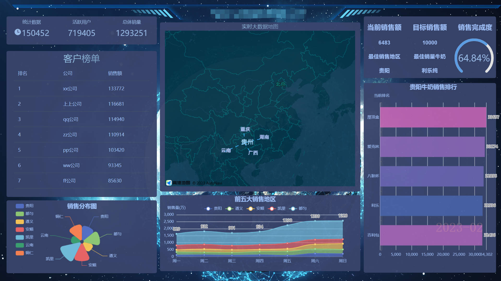

## 大数据展示界面

----
### 前端框架搭建
```
    ----vue3
    ----vite4
    ----vue-router4
    ----pinia   (暂未接入)
    ----naiveUI
    ----高德地图API
    ----自定义hooks
    
    2023.02.15 record
    当前实施到了初级阶段，一共接入7个展示模块
    包括动态数据、表格数据、扇形图、地图、折线图、仪表盘、动态数据排序
```
----
## 展示界面图

